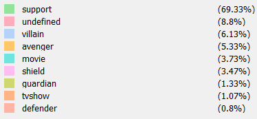
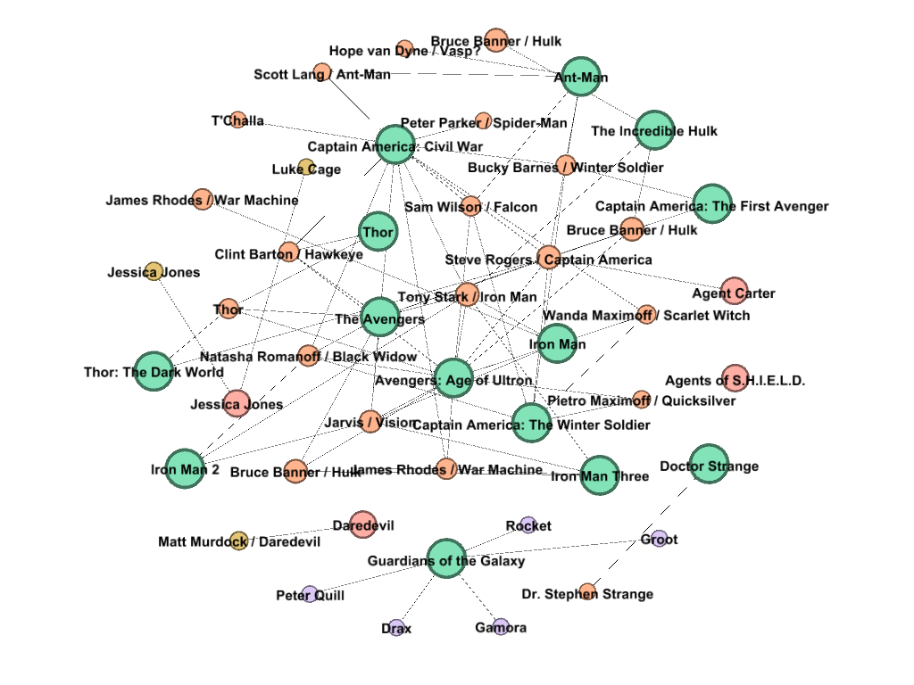

# Grafo do Universo Cinemático Marvel Extendido

**Marvel Cinematic Universe Graph. UFABC 1Q/2016 - Network & Communications Class.**

Universidade Federal do ABC - Bacharelado em Ciência da Computação  
Comunicação e Redes 2016/Q1  

  
Grafo do Universo Marvel Extendido

## Introdução

A análise da produção multimídia do estúdio Marvel (também chamada de universo Marvel cinematográfico, ou “MCU”) nos permite entender de que modo foi pensado e meticulosamente executado pelo estúdio Marvel tanto no sentido estratégico como de projeto esse universo compartilhado como um produto transmídia coeso, ainda que em três meios diferentes de entrega a saber: Cinemas, TV aberta ABC e Netflix, transformando-o num fenômeno pop que arrecadou somente nos cinemas desde 2008 U$ 9.08Bi com um custo de produção acumulado de U$ 2Bi. Vários campos com métricas temporais, de mercado, recepção da crítica especializada e público foram adicionados de diversas fontes para ajudar a explicar o “timming” de determinadas decisões criativas do estúdio desde 2008.

## Universo Marvel nos Cinemas

No caso do Universo Marvel, uma pesquisa rápida revelou que na internet, já constava um estudo pronto baseado em HQ's que compreendia grafos de grande diâmetro, o “Marvel Universe Social Graph” encontrado em http://exposedata.com/Marvel/, mas o estudo de maior destaque e que se tornou um modelo inicial de método para este projeto foi o “Marvel Cinema Universe Network Analysis” da CoryEverington, suas informações e conteúdos estão disponíveis no site https://datacolumn.wordpress.ncsu.edu/2016/03/27/Marvel-cinema-universe-network-analysis/.

  
Figura 1: Marvel Social Graph

  
Figura 2: Marvel Cinema Universe Network Analysis

## Fontes & Coleta

| Nome do Site     | Dados Resgatados | Endereço Web
| ----------- | ----------- | ----------- |
| IMDB	| Filme, Ano, Ator e Personagem	| www.imdb.com | 
| Rotten Tomatoes	| Índice de critica e público	| www.rottentomatoes.com | 
| Box Office Mojo	| Custo de produção e bilheteria	| www.boxofficemojo.com |

Foi criado um script em linguagem python que lê o código da página do filme ou série por exemplo a do filme “Homem de Ferro (2008)” http://www.imdb.com/title/tt0371746/, este script foi baseado numa análise da estrutura de tags HTML da página para extrair a informação pretendida. Como a estrutura é comum a todos os filmes, listamos e processamos  todos os filmes produzidos pelo estúdio Marvel já lançados ou agendados para lançamento até o ano presente (2016) com o mesmo script. Foram realizadas diversas melhorias como a de nas páginas referentes a séries especificamente recebermos o número de episódios que cada ator participou, possibilitando calcular um sistema de “peso” relativo explicado mais adiante. Esses dados são gerados em formato CSV.

  
Figura 3: código html da página de onde se extraiu a informação

  
Figura 4: Código Python usado para extrair dados html

Foram criadas três tabelas auxiliares no SQL Server 2012, o banco de dados escolhido para tratamento da saída gerada pelo script: Uma tabela de produções, uma tabela de exclusão e uma tabela de determinação de papel ou “role”. A primeira recebeu 18 linhas, uma para cada filme ou série alimentadas manualmente com o nome da produção em português e em inglês, seu ano de lançamento e os dados citados do “Rotten Tomatoes” e do “Box Office Mojo”. A tabela de exclusão foi usada para listar os personagens genéricos e repetidos a serem excluídos do processo como “Policial #1”, “Policial #2” ou “Médico #2”. A terceira e última tabela foi usada para incluir os personagens de destaque que foram classificados como “vingadores”, “defensores”, “guardiões”, “vilões”, “suporte”, “indefinido” ou “shield”.

Uma quantidade de dados teve de ser normalizada pois em diferentes páginas o mesmo personagem tem o nome ligeiramente diferente, o que se não tratado causaria inconsistências no grafo. Tendo em mente que o nome do ator não muda o usamos como “âncora” para renomear os personagens quando ocorrem duplicatas como no caso do “Tony Stark / Iron Man” e “Antony Stark / Iron Man” que se refere ao mesmo personagem. E importante notar que neste ponto, personagens como o “Hulk” têm três nós relacionados a ele: Dois por ter trocado de ator e um adicional pela voz do personagem ser feita por outro ator, isso é melhor detalhado adiante.

Em um dos filmes analisados e que ainda não foi lançado, chamado “Doutor Estranho” foram incluídos manualmente os nomes de personagens ainda que não confirmados pelo estúdio, o mesmo ocorreu  em outro filme onde alguns personagens não estavam creditados por aparecer somente em cenas pós créditos. Esses passos só foram possíveis por conhecer a fundo a coleção de dados em estudo.

  
Figura 5: Script de normalização de nomes de personagens baseado no ator

Foi elaborado um sistema de “peso” relativo de personagens num campo chamado “rank” onde cada aparição em um episodio de série conta “+1” para o personagem e cada aparição em filme incluindo cenas pós-créditos conta “+10” para o mesmo, para cada série foi atribuído o peso “+100” e para cada filme o peso “+200”, o total da soma para os personagens determina o valor do campo. Foi criado estes sistema para resolver distorções dos personagens de séries que eventualmente tem muitas participações e se não ponderados podem superar o “peso” de personagens mais conhecidos ou mais rentáveis dentro de uma produção.

Os dados relacionados foram inseridos em lote em duas tabelas chamadas “nodes” e “edges”, já preparadas com o layout pronto para exportação em CSV diretamente para o software Gephi. A mecânica adotada e o tratamento dos dados permitiu que o grafo final contasse com campos adicionais de dados disponíveis para manipulação, a saber: Ano, Custo, Bilheteria, Lucro, Índice de crítica, Índice de audiência, nome do ator (quando aplicável) e os campos tipo do papel do ator e ranking, ambos explicados anteriormente. O grafo é direcionado no sentido dos atores para as produções e estes campos adicionais estão melhor descritos na análise de resultados desse grafo.

## Resultados

Para melhor visualização dos resultados, uma tabela foi elaborada, indicando as as informações e seus usos.

| IDENTIFICAR | 	MCU |
| ----------- | ----------- |
| Origem dos dados	|Sites web de conteúdo específico|
| Natureza dos vértices	|Filmes, séries e atores|
| Arestas (significados)	|Participação do ator no filme ou série|
| Nº de vértices	|375|
| Nº de arestas	|489|
| Direcionado ou não	|Sim, do ator para a produção|
Tabela 3:  Finalidade de identificação de dados

| DISCUTIR SOBRE	| MCU |
| ----------- | ----------- |
| Modelo de crescimento da rede	|Dinâmico|
| Robustez	|Média|
| Facilidade de difusão da informação	|Muito Baixa|
Tabela 4:  Finalidade de discussão dados

| CALCULAR| 	MCU| 
| ----------- | ----------- |
| Grau médio	| 2,608| 
| Grau médio ponderado	| 1,304| 
| Diâmetro da rede	| 1|
| Densidade do grafo	|0,003|
| Componentes conexos	|3|
| Coeficiente de agrupamento (clustering)	|0|
| Total de triângulos	|0|
| Comprimento médio de caminho	|1|
Tabela 5:  Finalidade de calculo de características dos grafos.

## Grafo do Universo Marvel nos Cinemas

A rede do “Marvel Cinematic Universe” (ou MCU) é  direcionada, não ponderada e com grau médio de 2,608. Seu modo de construção é baseado nos atores relacionados de um para muitos com as produções nas quais participam, o que gera nela um diâmetro de rede 1, pois sendo uma rede direcionada, não há como estabelecer um caminho que não seja de um ator para uma produção, o que também elimina a necessidade de contagem por triângulos, que não são uma possibilidade neste caso pela ligação entre produções ocorrer exclusivamente pelos atores.

### Yifan Hu

  
Figura 10: Grafo completo, sem rótulos e com tamanho dos nós estabelecido pelo “rank e coloração pela “role”, dois campos artificiais inseridos na fase de tratamento de dados. Arranjo Yifan Hu Proporcional.

  
Figura 11: Legenda do campo “role”, vale para os demais grafos a seguir

Cada nó representa uma produção (seja para cinema, TV ou streaming) ou um ator. Usamos os atores como “âncoras” pois o nome dos personagens antes do tratamento é errático, o que prejudicaria a interpretação do grafo se utilizados sem tratamento. A utilização do ator como identificador de nó gera personagens repetidos como no caso do “Bruce Banner / Hulk”, que tem 3 nós diferentes de mesmo nome de personagem, pois cada um deles representa um ator direrente. Seu primeiro filme (do estúdio Marvel) é feito pelo “Edward Norton”, já nos seguintes ele foi substituído pelo ator “Mark Ruffalo” com a voz do personagem quando transformado feita pelo ator “Lou Ferrigno” o “Hulk” do seriado antigo de TV. Para encontrar os três “Hulks” no grafo aponte para o filme do Hulk de 2008 e em seguida para o filme dos Vingadores de 2012. Se utilizado o campo “aname” ou nome do ator como label dos nós fica clara no grafo a diferença entre eles.

## Campos adicionais

Campos de dados adicionais foram inseridos aos que foram extraídos do IMDB, depois de tratados e agrupados os dados:

|Campo	|Dado	|Uso|
| ----------- | ----------- | ----------- |
|Label	|Nome original	|Rótulo|
|morder	|Ordem de produção	|Se usado como filtro “range” mostra a evolução do universo Marvel lançamento a lançamento|
|myear	|Ano de produção	|Se usado como filtro “range” mostra a evolução do universo Marvel ano a ano|
|mcost	|Custo de produção	|Pode ser usado como tamanho do nó ou coloração|
|mgross	|Bilheteria mundial total	|Pode ser usado como tamanho do nó ou coloração|
|mprofit	|Lucro simples (Custo - Bilheteria)	|Pode ser usado como tamanho do nó ou coloração|
|mtomatometer	|Avaliação geral (crítica + público)	|Pode ser usado como tamanho do nó ou coloração|
|maudience	|Avaliação público	|Pode ser usado como tamanho do nó ou coloração|
|aname	|Nome da produção português	|Rótulo|
|type	|Tipo (movie, tvshow)	|Usado para coloração|
|role	|Igual ao tipo	|Usado para coloração|
|rank	|200 para filmes e 100 para tvshows	|Usado para tamanho|
Tabela 6: Campos adicionados para nós tipo Filme ou Show de TV

|Campo	|Dado	|Uso|
| ----------- | ----------- | ----------- |
|Label	|Nome do personagem	|Rótulo|
|morder	|Ordem de produção da primeira produção na qual participou	|Acompanha as produções lançamento a lançamento|
|myear	|Ano de produção da primeira produção na qual participou	|Acompanha as produções ano a ano|
|mcost		|Sem uso|
|mgross		|Sem uso|
|mprofit		|Sem uso|
|mtomatometer		|Sem uso|
|maudience		|Sem uso|
|aname	|Nome do ator	|Rótulo|
|type	|Tipo (actor)	|Coloração|
|role	|Ocupação do personagem (vingador, guardião, defensor, vilão, shield, indefinido ou apoio)	|Usado principalmente na coloração, mas eventualmente tamanho|
|rank	|+1 para cada episódio no qual aparece, +10 para cada filme no qual aparece	|Usado para tamanho|
Tabela 7: Campos adicionados para nós tipo Ator

## Modelo de crescimento

Seu modelo de crescimento pode ser observado utilizando os campos “morder” e “myear”, que vão mostrar a evolução do universo e como são adicionados nós (produtos/personagens) e arestas a cada lançamento ou a cada ano respectivamente. Cada nó com grau de entrada (filme ou show de tv) carrega forçosamente novos nós com grau de saída (novos personagens, na maioria de apoio somente) e uma quantidade de arestas que o ligam a outras produções preexistentes (em geral personagens mais famosos naquele universo) que no decorrer dos anos tende a ser menor a cada lançamento. Isso se reflete na relação de arestas por nó de 489/375, bem abaixo do primeiro grafo estudado.

  
Figura 12: Evolução do MCU nos anos 2008, 2010, 2012 e 2013 no sentido horário excluindo a “role” com valor  “support”. Arranjo Fruchterman Reingold.

Ainda no quesito crescimento é importantíssimo notar que é possível fazer através dele uma “engenharia reversa” de como foram e ainda são tomadas as decisões criativas no estúdio acerca da direção e tom usado lançamento a lançamento neste produto transmídia. Quando lançar um produto com grande grau de entrada no caso de um filme que reúna muitos personagens preexistentes como “Era de Ultron” ou “Guerra Civil” ou o “timming” certo de lançar um produto separado, quase sem conexões e na verdade de gênero diferente dos anteriores, como “Guardiões da Galáxia” uma “space opera”, “Homem-Formiga” um “filme de assalto” ou o ainda não lançado “Doutor Estranho” num gênero mais “fantástico” e flertando o terror, estratégia adotada possivelmente para evitar fadiga de material. É interessante entender como a análise de crescimento permite entender decisões criativo-executivas que tornaram este produto num sucesso da cultura pop, frente a outros universos compartilhados que também foram lançados como o da DC/Warner por exemplo, que enquanto produto coeso ainda não tiveram tanto êxito.

Este grafo tem três componentes conexos e a explicação para esse fato é sólida: Temos os filmes do universo Marvel bem conectados entre si por atores comuns entre eles, e estes as duas séries de TV do canal ABC chamadas “Agentes da Shield” e “Agente Carter”, este conjunto forma o componente maior. Um segundo componente é o das duas séries produzidas pela Netflix que citam os filmes ainda que não tenham participações de atores dos mesmos mas compartilham atores entre si, o que as tornam o segundo maior componente. O terceiro e último componente é um filme ainda não lançado, agendado para novembro deste ano (2016) chamado “Doutor Estranho“ que até agora não indicou personagens conectados ao restante desse universo, mas os terá certamente, o que vai uni-lo ao componente maior. Importante notar que personagens nas cenas pós créditos não são creditas no filme, por isso foram inseridos manualmente na fase de tratamento.

A discussão sobre o grau dos nós passa pelo fato de que séries, ainda que de projeção e geralmente faturamento inferior ao dos filmes, tendem a ter muito mais personagens no decorrer da temporada que um filme único de aproximadamente 2h, e como o grau de entrada dos nós que representam produções pode ser entendido como número de personagens nela, as séries invariavelmente têm destaque se utilizado este grau como medida de tamanho no grafo, enquanto o grau de saída coloca em destaque os personagens mais frequentes neste universo, onde temos o caso do “Stan Lee” por exemplo, que faz participações em todos os filmes e possui grau de saída relativo considerável, mesmo não sendo um personagem relevante nos enredos.

Estas duas abordagens geram distorções, pois personagens como o “Agente Colson” tem grau de saída maior que determinados Vingadores, o que não tem uma ligação estreita com a “realidade” de faturamento deste universo. Para estabelecer essa noção de “importância relativa” foi criado o campo “rank”, que é o meio mais comum de estabelecer tamanho de nós neste grafo. Ele tem uma característica de cálculo já explicada e ajusta casos como o do “Agente Coulson”, que participa em 4 filmes e 66 episódios de uma série, dando a ele uma importância ainda razoável porém mais próxima da influência da sua participação no faturamento das produções, este campo também corrige a distorção de séries maiores que filmes. O campo “role” também ajuda a filtrar personagens relevantes, se excluídos deste campo os personagens com role “support” temos o núcleo do MCU, se tirados dai as roles “undefined”, “shield” e “villain” temos somente os mais bem pagos atores deste universo.

Uma nota importante é que temos ferramentas para fazer previsões bem acuradas sobre o futuro do MCU com estes dados. O grafo abaixo representa o provável elenco do núcleo dos filmes “Guerra Infinita - Parte 1” a ser lançado em 2018 e “Guerra Infinita - Parte 2” com agenda para 2019.

  
Figura 13: Grafo do MCU excluindo roles “support”, “undefined” e “villain”.

Também é possível ter uma noção de renda destes filmes frente aos demais filmes desse universo pois nessa análise vemos uma relação forte da bilheteria com três fatores: Grau de entrada no nó; Peso relativo (rank) dos nós (atores) de origem na produção; Recepção da crítica de massa (tomatometer); Podemos interpretar estes fatores como os determinantes da compra do ingresso para o grande público.

Este tripé comporta o fato de que ainda que o segundo filme dos Vingadores “Era de Ultron” tenha tido uma recepção por parte da crítica pouco abaixo do primeiro filme dos Vingadores, ele manteve um faturamento mundial sólido com relação ao restante do universo Marvel.

  
Figura 14: Grafo do MCU, colorido pelo lucro com tamanho relativo a recepção positiva da crítica especializada.

Na figura acima, os rótulos de atores aqui têm seus nomes e não os de personagem. Os filmes “Doutor Estranho” e “Guerra Civil” estão bem descoloridos pois ainda não tinham informação de bilheteria. As séries de modo geral também não tem esta informação, mas foram mantidas por terem a informação de recepção da crítica

## Heróis

## Vilões

